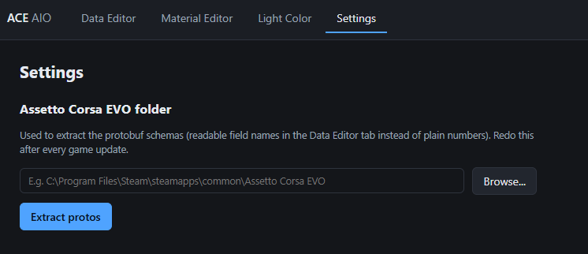
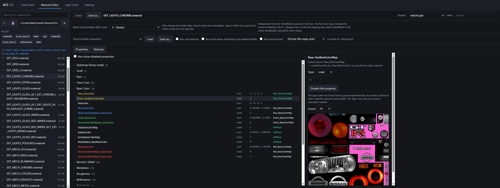
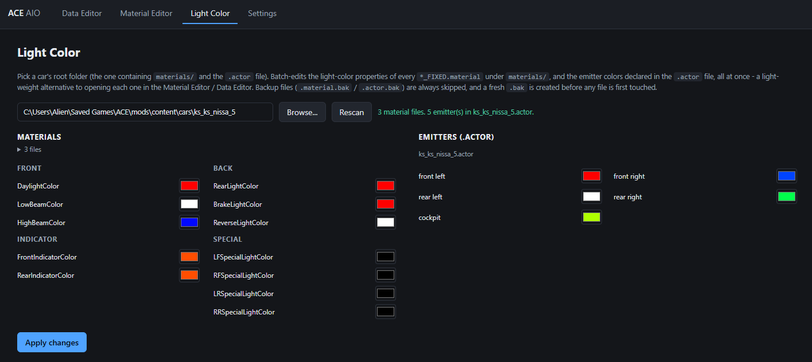

# ACE AIO — AC EVO Data Tools

Read and edit Assetto Corsa EVO content files, all from one browser-based app:
a data explorer, a material editor and a light-color batch editor, sharing a
single interface.

The game's data files are serialised Protocol Buffers messages. Better still,
the complete `.proto` schemas are embedded in the game executable, so fields
can be shown by their real names rather than by number.

```
main_lights[0].shared_lights[1]
  category         = Flashing
  light_function   = light_highbeam
  intensity_when_on = 1.0
  blinker_name     = "ON_200ms_200ms"
```

Everything round-trips **byte for byte**: a file written back without changes is
identical to the original.

## Requirements

Only needed if you run it from source - see [Quick start](#quick-start) for
the no-install option.

Python 3.9+ and:

```bash
pip install -r requirements.txt
```

(`protobuf` for decoding game files, `Pillow` for texture previews in the
Material Editor.)

## First run

The schemas are **not shipped** with these tools: they are extracted from the
game executable, so you generate them once from your own copy of the game.
This used to be a separate command-line script - it now lives in the app
itself, under the **Settings** tab:



Point it at your Assetto Corsa EVO install folder and click **Extract protos**.
This writes `data editor/proto/acevo.desc` (used by the tools) and 90 readable
`.proto` files (useful as a reference). Repeat it after a game update.

Without it everything still works and stays byte-exact, but fields show as
numbers instead of names.

## Quick start

> **Status: alpha.** Expect rough edges. Back up your content folder before
> editing regardless (see [Backups](#backups)).

**Don't want to install Python?** Grab the latest standalone Windows build
from the [Releases page](https://github.com/Breakalien/ac-evo-data-tools/releases) -
download the zip, extract it anywhere, and run `ACE AIO.exe`. No install, no
Python required.

**Running from source:**

```bash
python main.py
```

Open the address printed in the console — it carries a session token, so it
cannot be guessed. Or double-click `run.bat` on Windows.

Point it at your extracted game content with `--dir`, or just paste any path
into the address bar of the file browser once it is open.

## The interface

Four tabs, sharing the same window - one browser tab is all you need.

### Data Editor

- **Explorer** — browse any folder, bookmarks and recent list, search by
  filename scoped to the current folder.
- **Structured view** — collapsible tree, every value editable. Enum fields get
  a dropdown of the schema's real values.
- **Raw JSON tab** — for bulk edits, with *Apply to form*.
- **Find in file** (`Ctrl+F`) — searches field names *and* values, hides
  non-matching rows and expands the path to each hit. Works in both views.
- **Save** (`Ctrl+S`) — writes a `.bak` alongside the file on first save.

Fields shown in orange as `reserved` are field numbers the game's `.proto`
reserves, meaning they were deleted from the schema. Older content files still
carry values for them; the game ignores them. They stay editable and are
rewritten exactly.

### Material Editor

More advanced than the EvoForge one (kidding... but technically true 😄).
A few things it adds on top of a plain property editor:

- Colour-coded, alphabetically sorted properties — stop hunting for the field
  you need.
- Texture fields turn green the instant a texture is actually linked, so you
  know at a glance which slots are in use.
- Save and load presets, to carry a shader's property set across materials.
- The big one: a hidden opacity field nobody documents. If you've ever fought
  with opacity on a material, this is the answer.



### Light Color

A one-click light editor:

- Change every light and emitter colour for a car in one place. One click
  applies the edit instantly to *every* material generated from Blender, and
  patches the car's `.actor` file automatically to match — no need to open
  each file individually.
- For materials not generated from Blender, colours can still be tuned
  individually via the Material Editor or Data Editor.



### Settings

The Assetto Corsa EVO install folder and the schema extractor described in
[First run](#first-run) above.

## Note on the schemas

`protoc` crashes on the full set of extracted schemas, so the tools build their
descriptor pool directly from `acevo.desc` rather than going through `protoc`.

## Coverage

| Content | Files | Round-trip |
|---|---|---|
| `content/cars` | 1 879 | 1 879 |
| `content/tracks` | 5 204 | 5 204 |

Roughly 75 file types are recognised, including `.car`, `.carengine`,
`.suspension`, `.carledsystem`, `.carlightingsystem`, `.curve`, `.aisplinedata`,
`.scene` and `.material`.

Not protobuf, handled separately: `.extended_splinedata.bin` and
`.track_layout` (in-house binary formats), `.data` (already JSON), `.fbx`,
`.json`, `.csv`.

Files above ~1.5 MB are slow to open in the generic decoder, which builds a
Python dictionary tree many times the file size. The largest `.scene` files
reach 85 MB.

## Security

The UI exposes the file system for reading *and* writing, and any web page open
in your browser can send requests to `127.0.0.1`. Four safeguards:

| Control | Prevents |
|---|---|
| Listens on `127.0.0.1` only | access from the network |
| `Host` header check | DNS rebinding |
| Foreign `Origin` rejected | requests from another site |
| Random session token (`SameSite=Strict` cookie) | use of the API behind your back |

Do not share the printed URL: it contains the token.

Address reuse is disabled, so a second instance on the same port fails with a
clear message instead of silently shadowing the first one.

## License

MIT. See `LICENSE`.

This is an unofficial, fan-made tool. It is not affiliated with or endorsed by
Kunos Simulazioni. It ships no game data: the schemas are generated on your
machine from your own copy of the game.

## Backups

The first save of any file copies it to `<name>.<ext>.bak` (or `.material.bak` /
`.actor.bak` for the Material Editor and Light Color tabs). Later saves do not
overwrite that backup. Back up your content folder anyway before editing.
